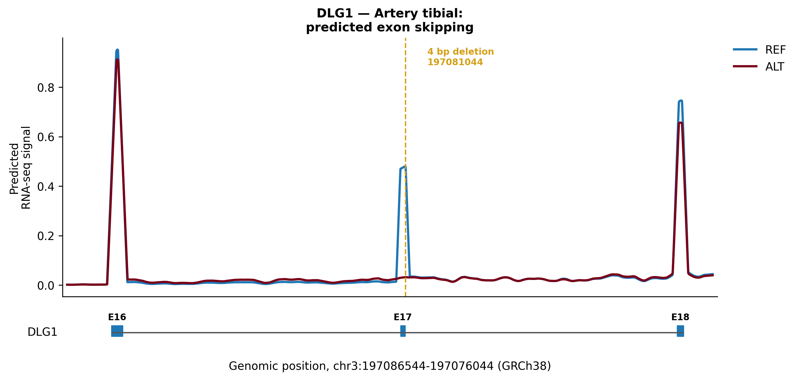
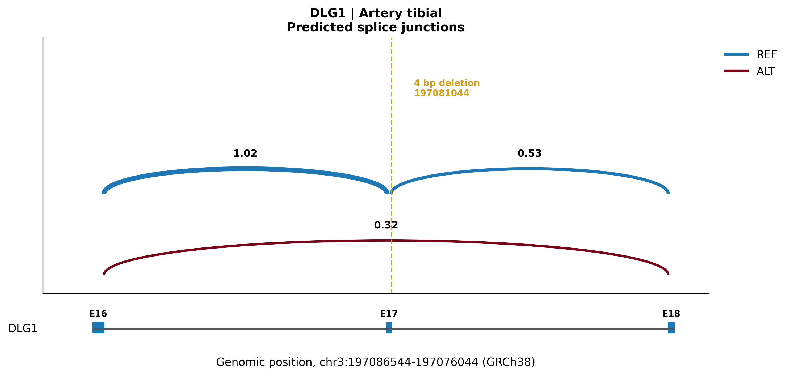
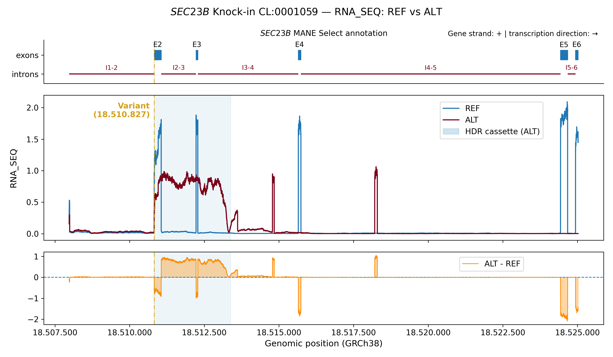
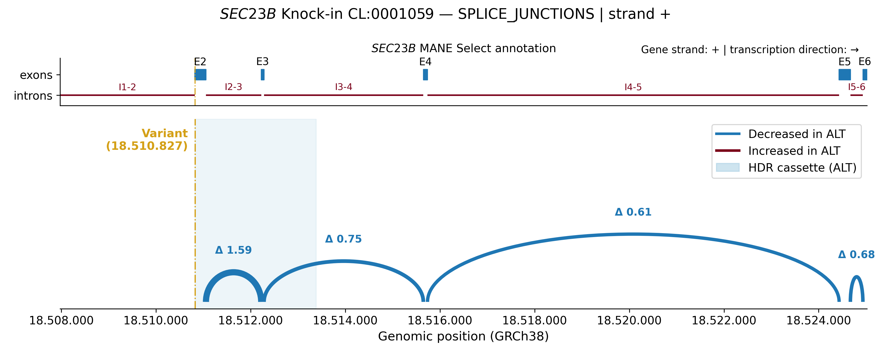

# Functional Assessment of Gene-Editing Strategies with AlphaGenome

Bioinformatics project developed as part of my Master's thesis at CIEMAT to explore AlphaGenome as a tool for predicting and interpreting the functional effects of genomic variants and gene-editing strategies.

## Project overview

I developed a reproducible Python workflow to run AlphaGenome predictions, process and export genomic outputs, and generate reusable visualizations. The workflow was validated by reproducing a published DLG1 exon-skipping case and subsequently applied to the functional assessment of a therapeutic knock-in strategy targeting SEC23B.

## What this repository demonstrates

- Development of reproducible bioinformatics workflows in Python.
- Integration and use of the AlphaGenome API for variant-effect prediction.
- Processing and visualization of RNA-seq, splice-site, splice-site-usage and splice-junction predictions.
- Genomic annotation using GTF files and automatic selection of MANE Select transcripts.
- Comparison of reference and alternative sequences across relevant cellular contexts.
- Structured export of results, reusable prediction files and execution logs for traceability.

## Case studies

- **DLG1 exon skipping:** reproduction of the splicing effects associated with a published deletion, used to validate the workflow against an established case.
- **SEC23B therapeutic knock-in:** comparative analysis of a complex gene-editing strategy, integrating predicted changes in gene expression and splicing across different cellular contexts.

## Selected results

### DLG1 workflow validation

The REF/ALT comparison reproduced the RNA-seq and splice-junction changes associated with skipping of the affected exon.





### SEC23B knock-in assessment

Application of the workflow to the therapeutic knock-in revealed predicted changes in RNA-seq signal and splice-junction patterns in a relevant hematopoietic context.





## Requirements and installation

To run the scripts:

1. Install Python and Conda.

2. Create and activate the provided environment:

   ```bash
   conda env create -f environment/environment.yml
   conda activate alphagenome
   ```

3. Obtain an AlphaGenome API key and define it as an environment variable:

   ```bash
   export ALPHAGENOME_API_KEY="your_api_key"
   ```

   The API key is not included in this repository. To make the variable persistent, add the previous command to `~/.bashrc` and run:

   ```bash
   source ~/.bashrc
   ```

4. Run the scripts from the project root directory.

### API usage

Not every script requires access to the AlphaGenome API:

- Data-processing and visualization scripts run locally and do not require an API key.
- Scripts that query the AlphaGenome model, including those using `score_variant()` or `predict_variant()`, require a configured API key.

Separating model inference from downstream visualization allows saved predictions to be explored repeatedly without making additional API requests.

## Repository structure

```text
alphagenome-ciemat/
├── alphagenome_key.py        # Reusable AlphaGenome API client
├── common.py                 # Shared utility functions
├── config.py                 # Shared visualization constants
├── scripts/                  # Scripts organized by experiment
├── experiments/              # Experiment documentation and run logs
├── raw-data/                 # Original input data
├── interm-data/              # Intermediate processed data
├── results/                  # Generated results
├── docs/                     # General documentation and data manifest
├── environment/              # Reproducible Conda environment
├── .gitignore                # Files excluded from version control
└── README.md                 # Project overview and usage instructions
```

## Experiments

### exp01 — Installation test

Initial verification of the AlphaGenome installation and API connection, establishing the reproducible project structure used in subsequent experiments.

- **Documentation:** `experiments/2026-04-06-exp01-installation-test/`
- **Scripts:** `scripts/2026-04-06-exp01-installation-test/`
- **Results:** `results/2026-04-06-exp01-installation-test/`

### exp02 — DLG1 exon skipping

Validation of the workflow through reproduction of the DLG1 exon-skipping case described by Avsec et al. (2026).

The experiment combines `score_variant()` and `predict_variant()` to examine RNA-seq, splice-junction, splice-site and splice-site-usage predictions. The resulting REF/ALT comparison reproduced the expected loss of exon inclusion and formation of the alternative junction associated with exon skipping.

- **Documentation:** `experiments/2026-04-10-exp02-exon-skipping/`
- **Scripts:** `scripts/2026-04-10-exp02-exon-skipping/`
- **Results:** `results/2026-04-10-exp02-exon-skipping/`

### exp03 — General variant-evaluation pipeline

Development of a reusable workflow for the functional assessment of genomic variants and its application to a therapeutic knock-in strategy targeting `SEC23B`.

The pipeline is divided into two main modules:

- `run-variant-pipeline.py` runs `score_variant()` and `predict_variant()`, processes and exports their outputs, and serializes the complete predictions as `prediction.pkl`.
- `visualize-prediction.py` reuses the saved prediction files to generate RNA-seq, splice-site, splice-site-usage and splice-junction visualizations without making additional API requests.

The workflow includes cellular-context selection, automatic gene annotation from GTF data, MANE Select transcript identification, structured result export and execution logs. This design supports traceability and enables the same analysis framework to be reused with other variants and genomic regions.

- **Documentation:** `experiments/2026-05-28-exp03-variant-pipeline/`
- **Scripts:** `scripts/2026-05-28-exp03-variant-pipeline/`
- **Results:** `results/2026-05-28-exp03-variant-pipeline/`

## Tools and technologies

Python · AlphaGenome API · pandas · Matplotlib · Conda · Git/GitHub · GTF annotation · genomic data processing

## Reproducibility

The repository includes a pinned Conda environment, experiment-specific documentation, structured output directories, a data manifest and execution logs. Full prediction objects are stored separately from visualization scripts, allowing downstream analyses and figures to be regenerated without repeating model inference.
